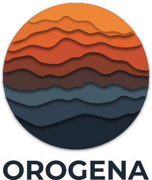

<p align="center">
    <picture>
        <source srcset="docs/assets/orogena_logo_dark.png" media="(prefers-color-scheme: dark)">
        <source srcset="docs/assets/orogena_logo.png" media="(prefers-color-scheme: light)">
        
    </picture>
</p>

<p align="center">Complete Worldbuilding Suite - Version 2.0</p>

## Overview

Orogena is a professional-grade worldbuilding application following [Artifexian's methodology](https://www.youtube.com/c/Artifexian), enabling the creation of geologically and climatologically plausible worlds from stellar parameters down to local detail.

### Key Features

- **Complete 19-system worldbuilding**: Stars → Planets → Tectonics → Climate → Resources
- **Multi-scale generation**: Planet → Continent → Region → Local detail
- **GPU-accelerated** simulation for tectonics, climate, and ocean currents
- **Realistic erosion** with drainage networks and river systems
- **Köppen climate zones** with biome mapping
- **Resource placement**: Fuel, ores, and salt deposits in geologically appropriate locations
- **Seamless tile boundaries** using intelligent border stitching
- **Database-backed caching** for instant revisits
- **Cross-platform** support (Linux, Windows, macOS)

### The 19 Worldbuilding Systems

| Category | Systems |
|----------|---------|
| **Foundation** | Star & planetary system, planet parameters, moons & tides |
| **Geophysics** | Plate tectonics, land topography, bathymetry |
| **Circulation** | Ocean currents, winds & pressure, upwelling & reefs |
| **Climate** | Precipitation, temperature, Köppen zones, biomes |
| **Hydrology** | Rivers, lakes, drainage networks, weather patterns |
| **Resources** | Rocks & minerals, fuel deposits, copper/bronze/iron ores, salt |

---

## Building from Source

### Prerequisites

- **Compiler**: Clang 21+ (recommended), GCC 10+, or MSVC 2019+
- **CMake**: 3.25+ (for CMake Presets support)
- **vcpkg**: For dependency management
- **Qt**: 6.8+
- **Ninja**: Build system (optional but recommended)

### Quick Start (Using CMake Presets)

```bash
# Clone the repository
git clone https://github.com/yourusername/orogena.git
cd orogena

# Setup vcpkg (first time only)
./scripts/setup_vcpkg.sh
source ~/.bashrc  # Reload shell

# One-command build (configure + build + test)
cmake --workflow --preset debug

# Run
./build/debug/src/orogena
```

**First time setup?** See [SETUP.md](SETUP.md) for detailed setup instructions.

**Build documentation:** See [BUILD_GUIDE.md](BUILD_GUIDE.md) for comprehensive build options.

### Platform-Specific Instructions

**Linux (Arch/CachyOS)**:
```bash
sudo pacman -S cmake clang ninja qt6-base mesa
cmake --workflow --preset release
```

**Windows** (using Visual Studio 2022):
```powershell
cmake --preset release
cmake --build --preset release
```

**macOS**:
```bash
brew install cmake llvm ninja qt@6
cmake --workflow --preset release
```

### Development vs Production Builds

```bash
# Development build (fast compile, debug symbols, tests)
cmake --workflow --preset dev

# Production build (optimized, LTO enabled)
cmake --workflow --preset release
```

### Available Build Presets

| Preset | Use Case | Tests | LTO | Speed |
|--------|----------|-------|-----|-------|
| `debug` / `dev` | Development | ✓ | ✗ | Fast compile |
| `release` | Production | ✗ | ✓ | Slow compile, fast runtime |
| `relwithdebinfo` | Profiling | ✓ | ✗ | Balanced |

See [PRESETS_SUMMARY.md](PRESETS_SUMMARY.md) for quick reference.

---

## Project Structure

```
orogena/
├── docs/               # Documentation
├── src/                # Source code
│   ├── core/          # Application foundation
│   ├── stellar/       # Stars, orbits, habitable zones
│   ├── planetary/     # Planet params, moons, tides
│   ├── global/        # Plate tectonics simulation
│   ├── topography/    # Land & bathymetry generation
│   ├── ocean/         # Ocean currents, upwelling
│   ├── atmosphere/    # Winds, pressure systems
│   ├── climate/       # Temperature, precipitation, Köppen
│   ├── hydrology/     # Rivers, lakes, drainage
│   ├── weather/       # Weather patterns
│   ├── geology/       # Rocks, minerals, cratons
│   ├── resources/     # Fuel, ores, salt deposits
│   ├── region/        # Regional tile system
│   ├── local/         # Local detail synthesis
│   ├── render/        # OpenGL visualization
│   ├── gui/           # Qt user interface
│   ├── database/      # SQLite persistence
│   └── utils/         # Logging and utilities
├── tests/             # Unit and integration tests
├── resources/         # Icons, UI files, presets
└── scripts/           # Build and packaging scripts
```

---

## Documentation

### Getting Started
- **[SETUP.md](SETUP.md)** - First-time setup guide (start here!)
- **[BUILD_GUIDE.md](BUILD_GUIDE.md)** - Comprehensive CMake Presets guide
- **[PRESETS_SUMMARY.md](PRESETS_SUMMARY.md)** - Quick preset reference

### Development
- [Software Development Plan v2.0](docs/001_sdp_orogena_v2.md) - Complete 12-phase roadmap
- [Coding Standard](docs/002_coding_standard.md) - Code style guide
- [Design Standard](docs/003_design_standard.md) - Architecture patterns
- [CLAUDE.md](CLAUDE.md) - AI-assisted development guide

---

## Development Status

**Current Phase**: Phase 0 - Foundation Completion

### Roadmap

| Phase | Milestone | Status |
|-------|-----------|--------|
| **0** | Foundation (database, settings, viewport) | In Progress |
| **1** | Stellar Foundation | Planned |
| **2** | Planetary Parameters | Planned |
| **3** | Enhanced Plate Tectonics | Planned |
| **4** | Topography Generation | **MVP v1.0** |
| **5-11** | Ocean → Climate → Resources | Planned |
| **12** | Integration & Polish | **Full Suite v2.0** |

**MVP (v1.0)**: Complete terrain generation from stellar parameters
**Full Suite (v2.0)**: All 19 Artifexian worldbuilding systems

See the [Software Development Plan v2.0](docs/001_sdp_orogena_v2.md) for detailed timeline.

---

## Contributing

Contributions are welcome! Please read the coding and design standards before submitting pull requests.

1. Fork the repository
2. Create a feature branch (`git checkout -b feature/amazing-feature`)
3. Follow the [Coding Standard](docs/002_coding_standard.md)
4. Write tests for new functionality
5. Commit your changes (`git commit -m 'feat: add amazing feature'`)
6. Push to the branch (`git push origin feature/amazing-feature`)
7. Open a Pull Request

---

## License

[License TBD]

---

## Acknowledgments

- Worldbuilding methodology inspired by [Artifexian](https://www.youtube.com/c/Artifexian)
- Built with Qt 6, OpenGL, and modern C++20
- Geological accuracy informed by plate tectonics and climate science research
